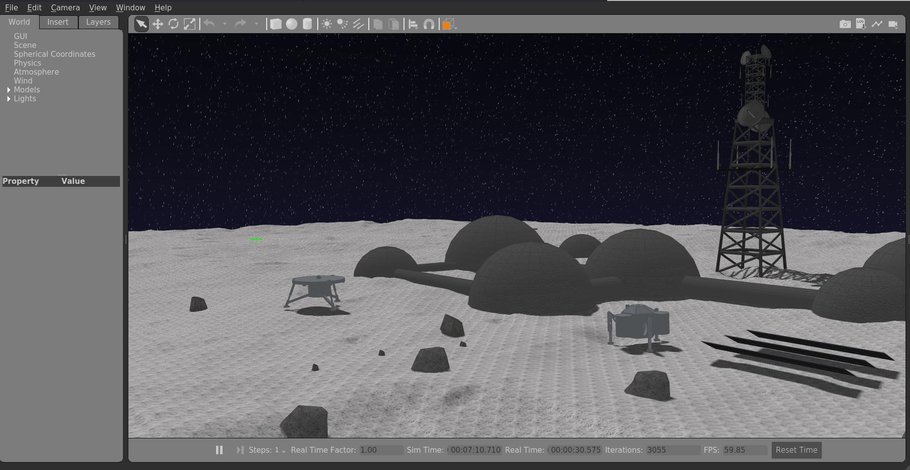

ezrassor_sim_gazebo
---------------------
 


The `ezrassor_sim_gazebo` package contains the worlds and models that the EZRASSOR can interact with when running in Gazebo 11.

usage
-----
```
command:
  ros2 launch ezrassor_sim_gazebo gazebo_launch.py [argument:=value]

optional arguments:
  world  *.world file name (default base.world)
```

example
--------
Launch the Gazebo client with the Moon world:
```
ros2 launch ezrassor_sim_gazebo gazebo_launch.py world:=moon.world
```   


testing
-------
Changes to this package will run through the test scripts found in the `test/` folder which include:
- Black formatting check
- PEP8 compliance check
- Environment hooks check for Gazebo

These tests will run automatically when changes are checked in via GitHub actions.  

Before you check in changes, please test your changes locally with Docker:
```sh
docker build -f build/Dockerfile -t ezrassor_sim_gazebo .
docker run ezrassor_sim_gazebo /check-environment.sh
docker run ezrassor_sim_gazebo /lint.sh
```